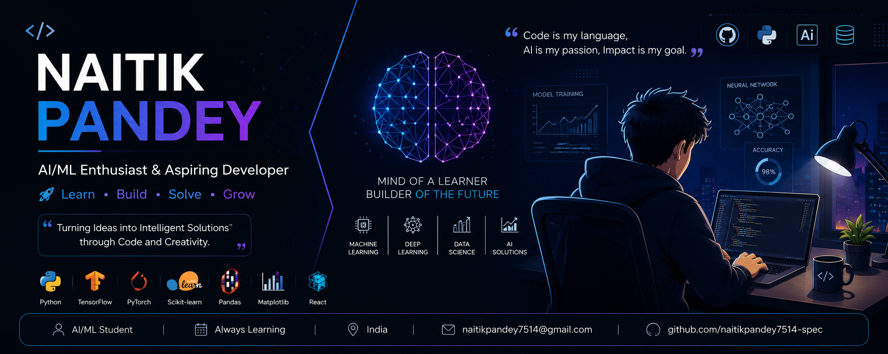

<div align="center">

<br/>


<br/><br/>


&nbsp;


</div>

---
<p align="center">

</p>

## 👨‍💻 About Me

```java
class AboutMe {

    Name = "Naitik Pandey";
    Education = "B.Tech (AI & ML)";
    Country = "India";

    Learning = {
        "Java",
        "Python",
        "Data Structures & Algorithms",
        "Web Development",
        "Machine Learning"
    };

    TechStack = {
     "Language" :  [ "Python","Java","JavaScript","C",];
      Frontend :  ["HTML","CSS","Bootstrap"];
       Tools : ["Git","GitHub","VS Code","IntelliJ IDEA"];
    };

    currentFocus =
        "Building projects, improving problem-solving skills, and exploring AI & Machine Learning.";

    Goal = "Learn • Build • Innovate • Repeat";

}
... "Thanks for visiting! Feel free to explore my projects.;
```
- 💬 **Ask me about:** Collaboration, Tech Support
- 📫 **How to reach me:**naitikpandey7514@gmail.com
- 😄 **Pronouns:** Naitik Pandey
- ⚡ **Fun fact:** Love Playing Cricket 

# 💻 Tech Stack:
        

<!-- Snake Game Repo View -->

<div align="center">
  
</div>

# 📊 GitHub Stats:
<br/>
<br>


## 📈 Contribution Graph


## 🏆 GitHub Trophies


### ✍️ Random  Quote


### 🔝 Top Contributed Repo


## 🌐 Socials:
[](https://instagram.com/naitikkk__05) [](https://linkedin.com/in/www.linkedin.com/in/naitik-pandey-5387b1371) [](mailto:naitikpandey7514@gmail.com) 

---
[](https://visitcount.itsvg.in)


